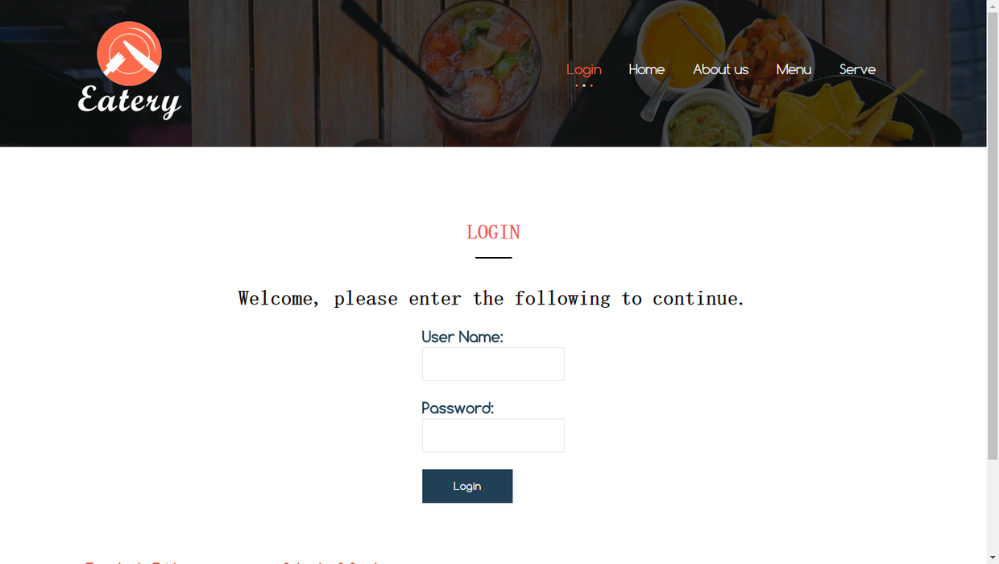
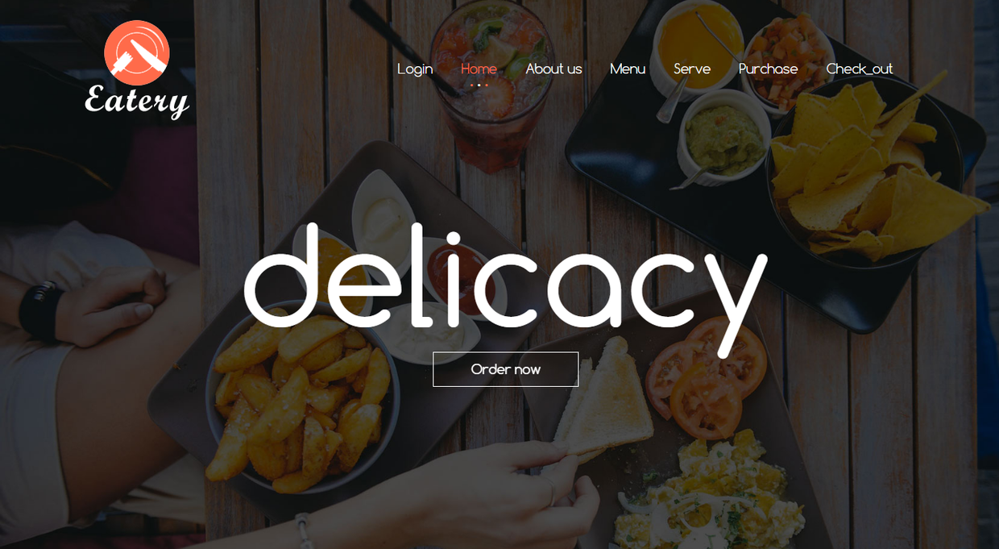
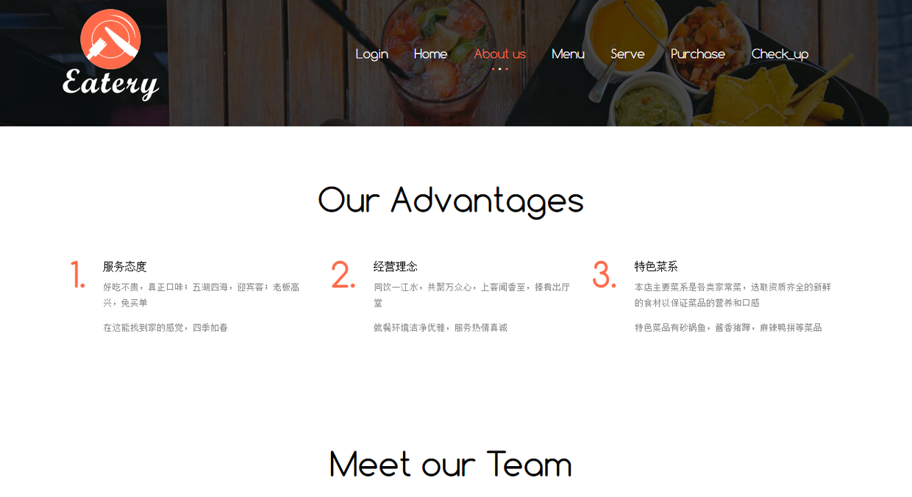
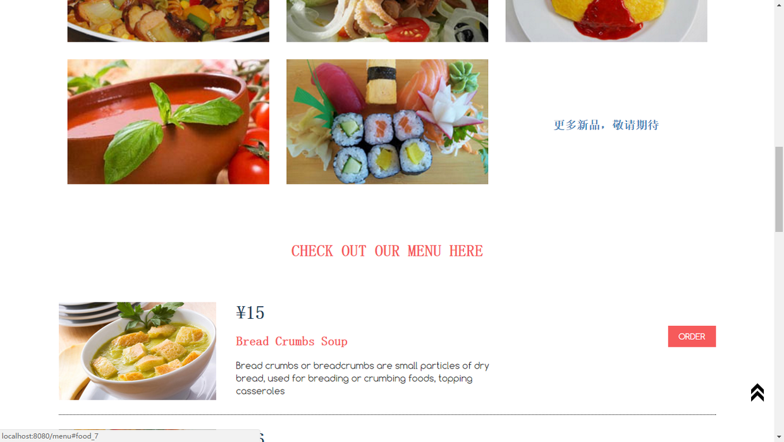
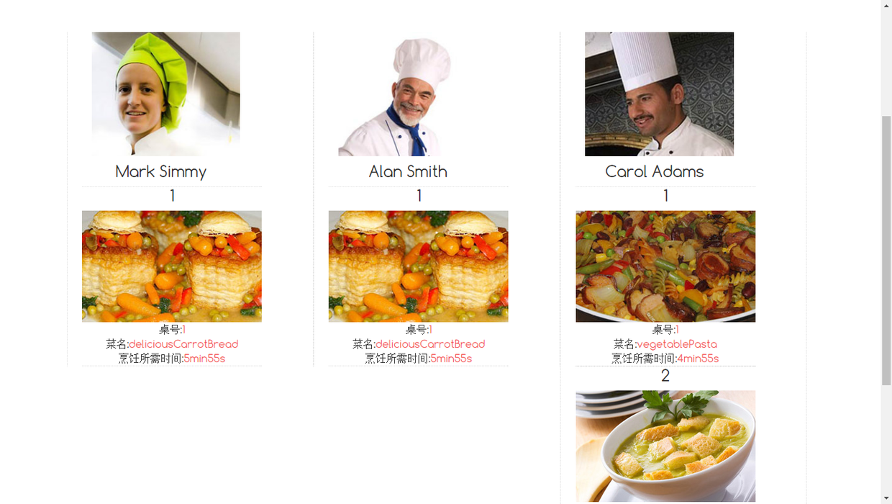
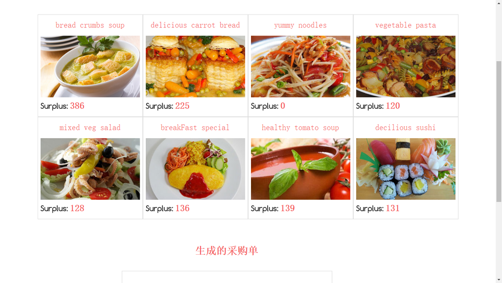
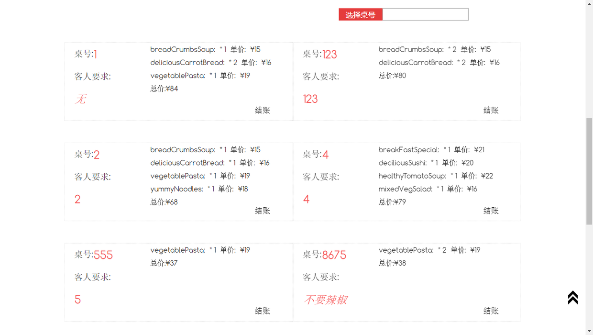

# restaurant-manage-system

前端基于bootstrap和jQuery框架，后端基于java SpringMvc框架的一个demo

## 主要技术栈
1. bootstrap
2. jQuery
3. SpringMvc

## 项目截图
1. 登陆界面

2. index界面

3. 广告界面

4. 菜单界面

5. 服务界面，观看上菜时间

6. 店家库存进货界面

7. 账单界面

## 如何使用
1.打开intellij IDEA

2.或者到pom.xml目录下用jetty运行